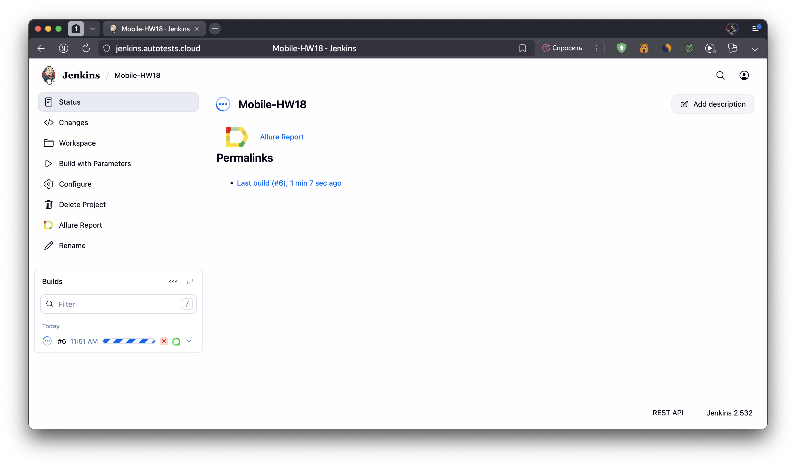
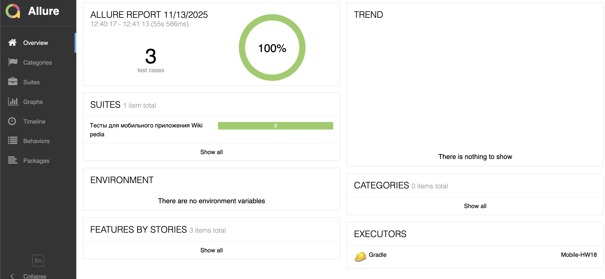
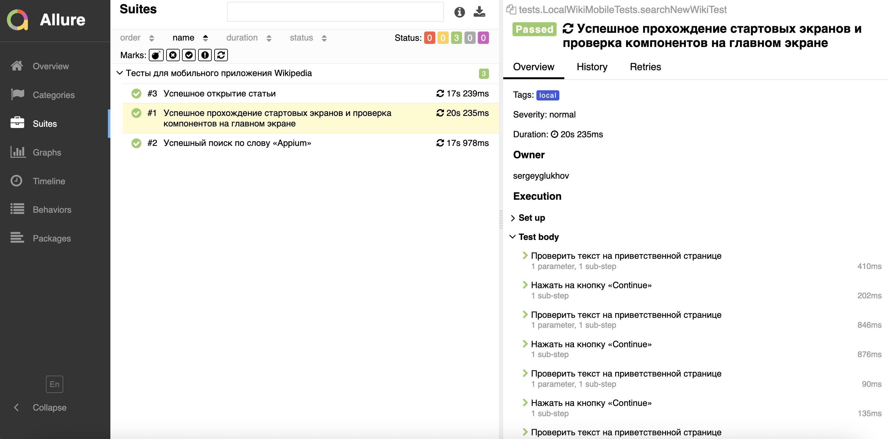

# Проект по автоматизации UI тестирования мобильного приложения Wikipedia
<p align="center"></p><a href="https://github.com/wikimedia/apps-android-wikipedia/releases/tag/latest"></a>

## Структура:

- <a href="#-стек">Стек</a>
- <a href="#-проведенный автотест">Проведенный автотест</a>
- <a href="#-сборка-в-Jenkins">Сборка в Jenkins</a>
- <a href="#-сборка-в-Jenkins">Особенности сборки в Jenkins</a>
- <a href="#-запуск-из-терминала">Запуск из терминала</a>
- <a href="#-allure-отчет">Allure отчет</a>
- <a href="#-видео-пример-прохождения-тестов">Видео пример прохождения тестов</a>

## 🛠️ Стек

<p align="center">


</p>

## ✅ Проведенный автотест

- Успешное прохождение стартовых экранов и проверка компонентов на главном экране
- Успешное открытие статьи
- Успешный поиск по слову «Appium»

## 📋 Сборка в [Jenkins](https://jenkins.autotests.cloud/job/Mobile-HW18/)

<p align="center">

</p>

### Особенности сборки в Jenkins:
Сборка в Jenkins собрана на прогон тестов через BrowserStack

## ▶️ Запуск из терминала

- На BrowserStack:

```shell
gradle clean test -DdeviceHost=browserstack
```

- Локального запуск на эмуляторе (Pixel 4):

```shell
gradle clean test -DdeviceHost=emulation
```

- Локального запуск на реальном устройстве (POCO C65):

```shell
gradle clean test -DdeviceHost=real
```

## 📑 Allure отчет
- ### Главный экран отчета
<p align="center">

</p>

- ### Страница с проведенным тестом
<p align="center">

</p>

## 🎦 Видео пример прохождения тестов
<p align="center">
  
</p>